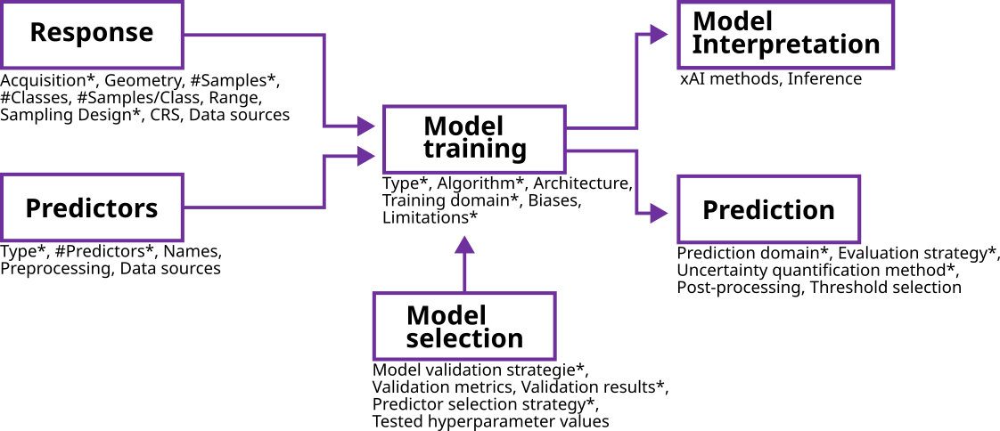

# STeMP

Machine learning (ML) methods, which can capture complex, non-linear, and interacting relationships without assuming specific data distributions, are increasingly used in geoscientific spatio-temporal modelling. 
However, their application comes with several challenges, especially when applied to spatio-temporal data.

A major concern is the lack of transparency in how key modelling decisions and input data characteristics are reported. 
This makes it difficult for practitioners and reviewers to assess the limitations of a model or judge the reliability of its predictions.

To address this, we introduce the **Spatio-Temporal Modelling Protocol (STeMP)**: a structured reporting framework. 
STeMP outlines a standard set of information that should be provided for each stage of a typical spatio-temporal modelling workflow, from response variable definition to model training and prediction. By completing this protocol, researchers can more clearly communicate the assumptions, choices, and context behind their models.



<!--
This [Shiny web application](https://odmap.wsl.ch/) helps to implement the ODMAP approach and produces well formatted protocols that can be exported for further usage. For further explanation please refer to the original publication [(Zurell et al., 2020)](https://onlinelibrary.wiley.com/doi/full/10.1111/ecog.04960). 
-->

## Try the app locally

### Requirements

To run the app, you need to have the following R packages installed:

```R
install.packages(c("shiny", "shinyjs", "shinythemes", "shinyWidgets", "shinyBS", "htmltools", 
                   "stringr", "knitr", "kableExtra", "dplyr", "utils", "workflows", 
                   "purrr", "data.table", "sf", "ggplot2", "CAST", "stats"))
```

### Run

You can run the app locally by installing the development version with

```R
library(remotes)
install_github("LOEK-RS/STeMP")
``` 

Then, you can start the app using the following command in R:

```R
library(STeMP)
run_app()
```

<!--

## Citation

Please cite as follows:

-->

## Acknowledgements

This app builds on the ODMAP protocol ([Zurell et al., 2020, Ecography](https://onlinelibrary.wiley.com/doi/full/10.1111/ecog.04960)), which standardizes reporting for species distribution models. 
We acknowledge the authors' foundational contribution.

